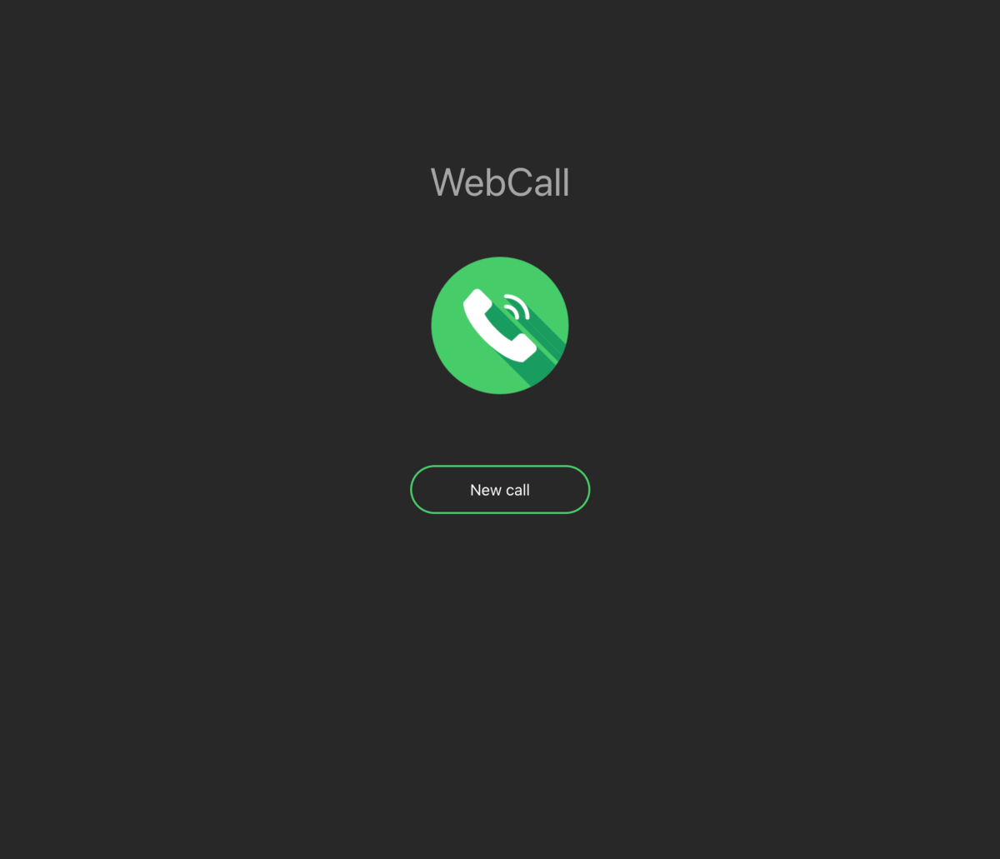

# WebCall

**[Live demo](https://happyappy.site/webcall)**

This is a simple project for video-calls using WebRTC.



## Features

- Video/audio call
- Live chat
- Screen sharing

## System requirements

- NodeJS 18+
- Python 3.8+
- PostgreSQL 16+

## Project Setup

```sh
npm install
```

### Compile and Hot-Reload for Development

```sh
npm run dev
```

### Type-Check, Compile and Minify for Production

```sh
npm run build
```

### Start python server

```sh
python backend/app.py
```

### Or if you want to use Docker run this command

```sh
docker-compose up -d --build
```
